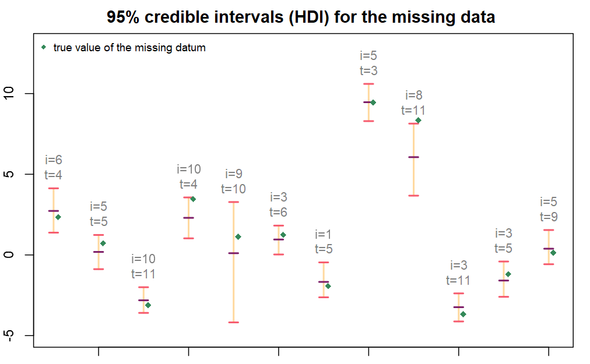
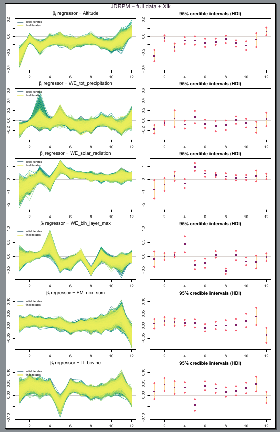
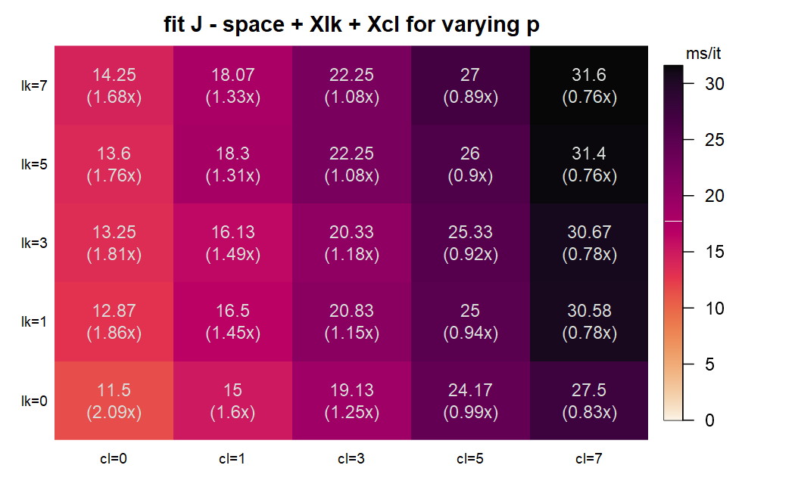

Note:
# Nota 1
- [x] In Figura 1.6 c'è un errore nella legenda, il termine "cluster 4" è ripetuto due volte.

Sistemato, era un errore dai copia incolla in julia

# Nota 2
- [x] Nella discussione alla fine del capitolo 1, aggiungerei come il fatto di standardizzare le covariate da utilizzare per il clustering può aiutare a scegliere parametri più "standard" per g4.

Ho fatto questa breve aggiunta per ora:
> On the other hand, similarity $g_4$ appeared to be quite sensitive to the parameters regulating the $\invgamma$ distribution for $\sigma^2$. **This suggests that covariates should be standardized prior to their usage, in order to simplify the research and uniform the choice of the most appropriate set of parameters.** In any case, the JDRPM implementation can provide some flexibility in this regard by possibly assigning separately the pair of $a_0$ and $b_0$ for each covariate that we wish to include in the clustering process.

# ⚠️NOTA⚠️
⚠️ Riguardo alle varie aggiunte comunque manderò un pdf con sottolineate/evidenziate bene le parti nuove.   
⚠️ perché magari quello che riporto in questo file lo aggiorno nel mentre che vado avanti  
⚠️ quindi questo è solo un file veloce per riassumere le mie risposte alle sue annotazioni

# Nota 3
- [x] Listing 2: perché non salvarti alcuni valori fissi, come lgamma(a_c), a_c\*log(b_c) e così via? Credo possano risultare in migliori performance in cambio di poca memoria salvata.

Giusto ci sta, dovrei rifattorizzare il codice ed è una modifica sensata ovviamente. Il suo impatto è magari minimo ma contando il numero di chiamate alle similarità/coesioni eventually farà risparmiare. Dovrei rifattorizzare il codice perché chiamando le coesioni e similarity in modo indiretto, tramite funzioni di questo tipo
```julia
function covariate_similarity!(idx::Real, X_jt::AbstractVector{<:Real}, cv_params::Vector, R::Real, lg::Bool, case::Int=1, add::Bool=false, lS=@MVector(zeros(2)), cv_weight::Real=1)
	if idx==1 similarity1!(X_jt,cv_params[1],lg,case,add,lS,cv_weight); return; end
	if idx==2 similarity2!(X_jt,cv_params[1],cv_params[2],lg,case,add,lS,cv_weight); return; end
	if idx==3 similarity3!(X_jt,cv_params[1],cv_params[2],lg,case,add,lS,cv_weight); return; end
	if idx==4 similarity4!(X_jt,cv_params[1],cv_params[2],cv_params[3],cv_params[4],lg,case,add,lS,cv_weight); return; end
end
```
diventa poi un po' meno immediato fare modifiche.

# Nota 4
- [x] In Sezione 3.1.1, non riesci ad ottenere esattamente lo stesso clustering aumentando il numero di iterazioni e di burnin? Inoltre, toglierei le informazioni riguardanti MSE, LPML e WAIC, lasciando solo l'execution time: il modello utilizzato, da un punto di vista teorico, è quasi uguale a quello originale di Page et al., cambia solo la scelta delle prior (InvGamma al posto di Uniform). Quindi, il miglioramento ottenuto nelle performance sembra essere più un risultato del caso piuttosto che il risultato di una nostra scelta modellistica. Per lo stesso motivo, le toglierei anche dalla sezione 3.1.2.

Per le metriche ci sta, tolgo. Per i fit ho sistemato aggiungendo iterazioni, e testando con vari parametri, ora sono più simili ma non sembrano mai volersi accordare perfettamente. Ma comunque avevo messo (e ho ora agggionato) dei commenti riguardo a perché entrambe le soluzioni fossero ragionevoli, e non essendo un cluster "esatto" forse ci sta che escano leggermente diverse.

Ho fatto anche questa aggiunta per esempio (da sistemare forse come le altre aggiunte riportate qui in questo file di appunti e note sui suoi suggerimenti)
> At this testing stage there were just the target values from $Y_{it}$ to dictate the clusters definition, and both models managed to provide good fits, as we can read from Table \ref{tab: fits metrics no space}. We can see how JDRPM obtained a faster execution time, which is however not really relevant in this small-sized fit. Regarding the fitted values, displayed in Figure \ref{fig: fitted and target values no space} together with the original data, they turned out to be also more precise than the one generated by CDRPM, having lower mean squared errors. **We do not report the fitting metrics of WAIC and LPML since the models were conceptually equivalent and tested under the same hyperparameters and MCMC iteration setup. Therefore, any observed difference in these metrics could be likely attributed to chance.**

# Nota 5
- [x] In vari punti del testo ho visto che hai scritto "trough", invece dovrebbe essere "through". Infatti, con "trough" si intende una mangiatoia per animali (https://www.dictionary.com/browse/trough), che non credo rientri nei nostri discorsi.
- [x] Alla fine di pagina 33 c'è un "helps to emphasizes", va corretto in "helps to emphasize".

Si qui mi spiace se ti/vi ho fatto spulciare ogni parola, pensavo che la vostra correzione si riferisse solo ai concetti, mentre la sintassi e gli errori sintattici li avrei naturalmente ricontrollati io alla fine.

# Nota 6
- [ ] Nelle sezioni 3.2.1 e 3.2.2 sarebbe carino mostrare i credible intervals nei punti in cui mancano i dati, in questo modo possiamo verificare se la vera osservazione cade nel credible interval. Non sono sicuro che mostrarlo per tutti i punti mancanti sia fattibile, magari nel caso possiamo mostrarlo per pochi esempi (magari alcuni che funzionano e altri che non funzionano). Un'altra cosa che potresti fare è mettere a NA un'intera time series e plottare media e credible intervals ottenuti per quella time series, così da vedere quanto il modello è bravo a predirre per un punto nello spazio in cui non potrebbe non esserci un sensore. Per intenderci, come in Figura 2 e Figura 3 a pagina 1013 di questo documento: https://it.pearson.com/content/dam/region-core/italy/pearson-italy/pdf/Docenti/Universit%C3%A0/bozza-book-compresso-new1.pdf. Questa cosa potrebbe essere fatta prendendo un punto e poi facendo vedere gli intervalli nel caso del modello base, poi con il clustering spaziale, poi con le covariate in likelihood e/o clustering. Si suppone che aumentando la complessità del modello piano piano ci sia un miglioramento nella predizione.

Per i fit NA senza spazio li ho aggiunti ora. Ho dovuto cambiare il dataset di test, e quindi rifare i fit, perché quando li avevo fatti la prima volta non mi ero salvato i seed, quindi mi ero perso quali indici fossero stati assegnati a NA. Invece ora è tutto più preciso e coerente.

Il grafico dei CI per il test NA sarebbe questo:


# Nota 7
- [x] Sezione 3.3: a questo punto, standardizzerei direttamente le covariate. In questo modo, hai anche una maggiore interpretabilità dei beta che ottieni.

Qui dovrei aver già sistemato. Forse aveva fatto questa nota in una vecchia "versione" del documento, in cui in effetti avevo riportato dei risultati senza standardizzare le covariate. Ora/dopo un qualche aggiornamento avevo invece usato ovunque covariate standardizzate. Infatti ho messo come premessa alla sezione 3.3 (che comunque diventerà 2.3 perché la prof mi ha detto di far partire la numerazione 1 dal capitolo description of the model):

> To perform the fits that will now follow, all the included covariates were treated
> in the same way as the target value, with the time-wise centering procedure and
> reasoning described in Section 3.1.2. Figure 3.15 provides an exemplification of the
> effect of this transformation on one of the covariates. Again, this was performed in
> order to remove any trend or bias on the covariates and to equalize their contribution
> at each time instant.

# Nota 8
- [x] Dalle Figure 3.17 e 3.18 non si capisce molto come va la MCMC, sono troppe time series sovrapposte. Io farei vedere qualche trace plot per mostrare che la catena converge (quindi dovrebbero essere i soliti bruchi pelosi, per intenderci) e poi manterrei la stessa struttura delle Figure 3.17 e 3.18, ma al posto di plottare tutte le time series plotterei i credible intervals (con la media indicata da una linea più scura), magari collegandoli tra i vari istanti temporali.

Qui geniale mi piace come modifica. L'ho inserita ma non so se il plot è ancora troppo "pieno"; è di sicuro ancora denso ma ora occupa una pagina tutta sua, quindi questo dovrebbe dargli più aria. Avevo pensato ad un layout con 4 righe e 2 colonne, 2 righe sopra per due trace plot e le altre 3 per i 6 credible intervals. Ma mettendo due soli trace plot magari veniva il dubbio di quali mettere, perché hai messo proprio quelli, cosa nascondono gli altri, ecc.

La riporto anche qui comunque.



# Nota 9
- [x] Le Figure 3.26, 3.27 e 3.28 hanno moltissime informazioni, quindi per un lettore non è facilissimo captare subito le differenze tra le varie figure. Suggerirei, nella discussione alla fine della Sezione 3.2.2, di mettere qualche esempio riferito alle figure dove si vede subito la differenza tra i clustering, così un lettore sa subito dove guardare.

Fatto. Ho inserito nel testo un'indicazione di in quali istanti temporali si possa osservare meglio l'effetto dato dalle covariate.
L'ho scritto nel testo ma anche nella caption dell'immagine.
> **The effects of the covariates contributions can be seen more clearly at time instants 8, 9, and 12.**

# Nota 10
- [ ] Aggiungerei qualche chiacchiera su cosa vuol dire avere le covariate nella likelihood rispetto al clustering: avere le covariate solo nella likelihood vuol dire considerare solo l'effetto lineare della covariata, avere le covariate solo nel clustering vuol dire considerare tutti gli effetti della covariata nel clustering (quindi, tanti cluster molto specifici), avere le covariate sia nella likelihood che nel clustering vuol dire considerare gli effetti lineari nella likelihood e solo gli effetti nonlineari nel clustering (quindi, meno cluster). Puoi trovare un piccolo paragrafo che ne parla nella sezione 3.2 di Quintana, F. A., Müller, P., & Papoila, A. L. (2015). Cluster‐Specific Variable Selection for Product Partition Models. Scandinavian Journal of Statistics, 42(4), 1065–1077. https://doi.org/10.1111/sjos.12151.

# Nota 11
- [x] Nella sezione 3.4, aggiungerei qualche commento testuale per sottolineare il miglioramento che si vede dalle immagini (visto che è uno dei punti forti della tesi). Per esempio, potresti dire che con T=50 il JDRPM va meglio del modello C anche se utilizza 5 covariate sia nella likelihood che nel clustering. Inoltre, ricorderei i valori di n, T e p dell'applicazione che hai presentato prima, per mostrare che in un'applicazione reale la tua implementazione comporta un miglioramento delle prestazioni.

Aggiunto del testo che marca questo miglioramento:
> Figure \ref{fig: scaling target space covariates} shows how fits including covariates saw a drop of performance, which was inevitable due to the additional work to perform, but they still remain at a good performance level. Indeed, Figure \ref{fig: summary performance scaling} will point out how some of the fits with all information levels in Julia were actually faster than the basic fits in C**; which is quite surprising given the additional complexity and computations introduced by the covariates.**

> **Also in the noisier environment in which the real-application fits of Section \ref{Target variable plus space} were performed, where we did not try, as instead we did in this dedicated section, to devote all the hardware resources to the models fitting, a considerable speedup was observed. In that case, in which the dataset consisted of $n=105$ units and $T=12$ time instants, the CDRPM fit with target plus space values took 1 hour and 38 minutes, while both the JDRPM fits, with equivalent setup and with covariates in the clustering, exhibited faster execution times. Remarkably, the equivalent JDRPM fit more than halved the execution time; while the fit including covariates showed the expected speedup reported by Figure \ref{fig: summary performance scaling}, if we look at the closest corresponding case of $n=100$ and $T=10$. This is definitely a further proof of the effectiveness of the new implementation.**

# Nota 12
- [x] Farei anche uno studio in cui, fissati n e T a valori ragionevoli (per esempio, 50 e 50), verifichi il tempo computazionale al crescere di p. In questo modo, dovresti trovare il numero di covariate tale per cui le tue performance arrivano alle performance di CDRPM (senza covariate).

Fatto. È una singola matrice in cui ci sono fit julia con spazio + xcl + xlk, con p che variano da 0 (cioè assenti) a ECC. Pensavo fosse un modo sensato e comodo per vedere l'effetto dell'aggiunta di quante covariate e in quali zone (se in un livello, nell'altro, o entrambi).

Il testo è per ora uscito così: (sempre un po' provvisorio comunque, devo sistemarlo ancora per la versione finale)
> Figure \ref{fig: scaling target space covariates} shows how fits including covariates saw a drop of performance, which was inevitable due to the additional work to perform, but they still remain at a good performance level. Indeed, Figure \ref{fig: summary performance scaling} will point out how some of the fits with all information levels in Julia were actually faster than the basic fits in C; which is quite surprising given the additional complexity and computations introduced by the covariates.

> **From the encouraging results of Figure \ref{fig: summary performance scaling}, we also investigated at which model complexity the JDRPM implementation would tie the execution times proposed by CDRPM. To do so, we selected a possibly regular-sized dataset, of $n=50$ and $T=50$, and we took as reference the execution time per iteration exhibited by the CDPRM fit in the case of target plus space values. Figure \ref{fig: scaling target space} retrieves this value to be 24 ms/it. Then, we evaluated the performance of JDRPM fits including covariates, at likelihood and/or clustering levels, letting now $p$ be varying, to see at which degree of complexity the new implementation match the original one. Figure \ref{fig: test varying p} summarizes the result of this analysis. It appears that until we include $p_\text{cl}=5$ covariates in the clustering, we can expect the JDRPM implementation to be faster than the simple spatially-informed fit on CDRPM. This means that in the same time in which the CDRPM performed a spatially-informed fit, JDRPM can perform the same fit plus up to five covariates in the clustering and a possibly indifferent number of covariates in the likelihood, since the increase of $p_\text{lk}$ did not highlight any significance drop in the performances.**



> **As in the previous tests of this section, this analysis was performed trying to devote all the computational resources to the fitting task; therefore the results should be accurate. As a further proof, the comparison performed in Section \ref{Covariates in the clustering} and summarized in Table \ref{tab: fits metrics space all with also Xcl} showed a fit with JDRPM plus three covariates in the clustering to take 1h20m. Corresponding to this case ($p_\text{lk}=0$, $p_\text{cl}=3)$), Figure \ref{fig: test varying p} suggests a speedup factor of 1.25x; and indeed this would imply an expected time of 1h40m in the CDRPM fit, which is practically matching the measured one of 1h38m.**

# Nota 13
- [x] Riguardo l'appendice C, secondo me puoi lasciarla come ultima cosa da fare se avanza tempo. La tua tesi non è applicativa, l'applicazione è utile soltanto per far vedere che il modello è sensato. Perciò, una analisi interpretativa dei risultati mi sembra qualcosa di molto marginale.

Ok vediamo se avanza tempo nei prossimi giorni.